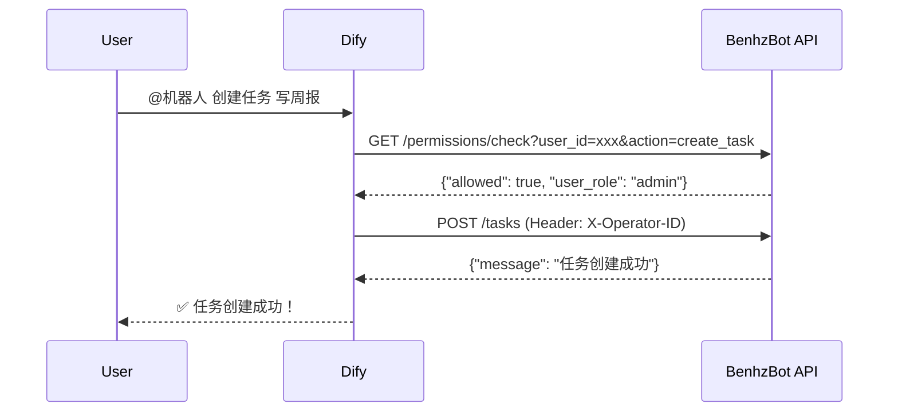
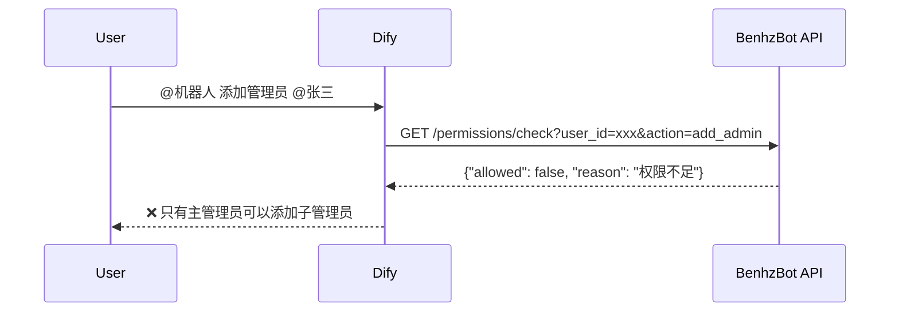

# BenhzBot API 文档

## 概述

本文档描述了 BenhzBot 后台权限管理 API，供 Dify 大模型集成使用。

**基础 URL**: `http://your-server:port/api/v1`

**架构流程**:
```
用户消息 → Dify大模型 → 调用权限查询API → 判断权限
                              ↓
                        权限不足 → 返回拒绝消息
                              ↓
                        权限通过 → Dify调用后台执行API → 执行任务
                              ↓
                        后台容错检查（二次验证）
```

---

## 权限系统说明

### 角色定义

- **super_admin** (主管理员): 拥有所有权限，可以添加/删除子管理员
- **admin** (子管理员): 可以管理任务（创建、更新、删除任务）
- **member** (普通成员): 可以打卡和查看统计

### 权限列表

| 权限名称 | 描述 | super_admin | admin | member |
|---------|------|------------|-------|--------|
| add_admin | 添加子管理员 | ✅ | ❌ | ❌ |
| remove_admin | 移除子管理员 | ✅ | ❌ | ❌ |
| create_task | 创建任务 | ✅ | ✅ | ❌ |
| update_task | 更新任务 | ✅ | ✅ | ❌ |
| delete_task | 删除任务 | ✅ | ✅ | ❌ |
| list_tasks | 查看任务列表 | ✅ | ✅ | ✅ |
| complete_task | 打卡完成任务 | ✅ | ✅ | ✅ |
| view_stats | 查看统计 | ✅ | ✅ | ✅ |

---

## API 端点

### 1. 权限检查

检查用户是否有权限执行指定操作。

**请求**:
```http
GET /api/v1/permissions/check?user_id={userID}&action={action}
```

**参数**:
- `user_id` (必需): 钉钉用户ID
- `action` (必需): 权限名称（见上方权限列表）

**示例请求**:
```bash
curl "http://localhost:8080/api/v1/permissions/check?user_id=user123&action=create_task"
```

**响应 200 OK**:
```json
{
  "allowed": true,
  "user_role": "admin",
  "reason": "用户角色为 admin，有权限执行 create_task"
}
```

**响应示例（权限不足）**:
```json
{
  "allowed": false,
  "user_role": "member",
  "reason": "用户角色为 member，无权限执行 create_task"
}
```

---

### 2. 获取用户信息

获取用户的详细信息和权限列表。

**请求**:
```http
GET /api/v1/users/{userID}
```

**路径参数**:
- `userID`: 钉钉用户ID

**示例请求**:
```bash
curl "http://localhost:8080/api/v1/users/user123"
```

**响应 200 OK**:
```json
{
  "user_id": "user123",
  "username": "张三",
  "role": "admin",
  "permissions": [
    "create_task",
    "update_task",
    "delete_task",
    "list_tasks",
    "complete_task",
    "view_stats"
  ],
  "created_at": "2025-01-01T00:00:00Z",
  "updated_at": "2025-01-01T00:00:00Z"
}
```

**错误响应 404 Not Found**:
```json
{
  "error": "用户不存在"
}
```

---

### 3. 提升用户为子管理员

将指定用户提升为子管理员（需要主管理员权限）。

**请求**:
```http
POST /api/v1/admin/users/{userID}/promote
Content-Type: application/json
```

**路径参数**:
- `userID`: 目标用户的钉钉用户ID

**请求体**:
```json
{
  "operator_id": "super_admin_user_id",
  "target_username": "张三"
}
```

**字段说明**:
- `operator_id` (必需): 操作者的钉钉用户ID（必须是主管理员）
- `target_username` (可选): 目标用户的用户名

**示例请求**:
```bash
curl -X POST "http://localhost:8080/api/v1/admin/users/user123/promote" \
  -H "Content-Type: application/json" \
  -d '{
    "operator_id": "admin001",
    "target_username": "张三"
  }'
```

**响应 200 OK**:
```json
{
  "message": "成功将用户提升为子管理员",
  "user_id": "user123"
}
```

**错误响应 403 Forbidden**:
```json
{
  "error": "只有主管理员可以添加子管理员"
}
```

---

### 4. 移除子管理员权限

移除用户的子管理员权限（需要主管理员权限）。

**请求**:
```http
POST /api/v1/admin/users/{userID}/demote
Content-Type: application/json
```

**路径参数**:
- `userID`: 目标用户的钉钉用户ID

**请求体**:
```json
{
  "operator_id": "super_admin_user_id"
}
```

**示例请求**:
```bash
curl -X POST "http://localhost:8080/api/v1/admin/users/user123/demote" \
  -H "Content-Type: application/json" \
  -d '{
    "operator_id": "admin001"
  }'
```

**响应 200 OK**:
```json
{
  "message": "成功移除用户的子管理员权限",
  "user_id": "user123"
}
```

---

### 5. 列出所有管理员

获取所有主管理员和子管理员的列表。

**请求**:
```http
GET /api/v1/admin/users/admins
```

**示例请求**:
```bash
curl "http://localhost:8080/api/v1/admin/users/admins"
```

**响应 200 OK**:
```json
{
  "super_admins": [
    {
      "id": 1,
      "dingtalk_user_id": "admin001",
      "username": "主管理员",
      "role": "super_admin",
      "created_at": "2025-01-01T00:00:00Z",
      "updated_at": "2025-01-01T00:00:00Z"
    }
  ],
  "admins": [
    {
      "id": 2,
      "dingtalk_user_id": "user123",
      "username": "张三",
      "role": "admin",
      "created_at": "2025-01-02T00:00:00Z",
      "updated_at": "2025-01-02T00:00:00Z"
    }
  ]
}
```

---

### 6. 创建任务

创建新任务（需要 create_task 权限）。

**请求**:
```http
POST /api/v1/tasks
Content-Type: application/json
X-Operator-ID: {operator_dingtalk_id}
```

**请求头**:
- `X-Operator-ID` (必需): 操作者的钉钉用户ID，用于权限验证

**请求体**:
```json
{
  "name": "写周报",
  "description": "每周五提交周报",
  "type": "TASK",
  "cron_expr": "0 17 * * 5",
  "deadline_time": "17:00:00",
  "advance_minutes": 30,
  "group_chat_id": "group123",
  "group_chat_name": "技术团队",
  "status": "ACTIVE"
}
```

**字段说明**:
- `name` (必需): 任务名称
- `description` (可选): 任务描述
- `type` (必需): 任务类型 (`TASK` 或 `NOTIFICATION`)
- `cron_expr` (必需): Cron 表达式
- `deadline_time` (可选): 截止时间（格式: HH:MM:SS）
- `advance_minutes` (可选): 提前提醒分钟数
- `group_chat_id` (必需): 群聊ID
- `group_chat_name` (可选): 群聊名称
- `status` (可选): 任务状态（默认 `ACTIVE`）

**示例请求**:
```bash
curl -X POST "http://localhost:8080/api/v1/tasks" \
  -H "Content-Type: application/json" \
  -H "X-Operator-ID: admin001" \
  -d '{
    "name": "写周报",
    "type": "TASK",
    "cron_expr": "0 17 * * 5",
    "group_chat_id": "group123",
    "status": "ACTIVE"
  }'
```

**响应 200 OK**:
```json
{
  "message": "任务创建成功",
  "task": {
    "id": 1,
    "name": "写周报",
    "type": "TASK",
    "cron_expr": "0 17 * * 5",
    "created_at": "2025-01-01T00:00:00Z"
  }
}
```

**错误响应 403 Forbidden**:
```json
{
  "error": "权限不足，无法创建任务",
  "reason": "用户角色为 member，无权限执行 create_task"
}
```

---

### 7. 获取任务列表

获取指定群聊的任务列表（需要 list_tasks 权限）。

**请求**:
```http
GET /api/v1/tasks?group_chat_id={groupChatID}
X-Operator-ID: {operator_dingtalk_id}
```

**请求头**:
- `X-Operator-ID` (必需): 操作者的钉钉用户ID

**查询参数**:
- `group_chat_id` (必需): 群聊ID

**示例请求**:
```bash
curl "http://localhost:8080/api/v1/tasks?group_chat_id=group123" \
  -H "X-Operator-ID: user123"
```

**响应 200 OK**:
```json
{
  "tasks": [
    {
      "id": 1,
      "name": "写周报",
      "type": "TASK",
      "cron_expr": "0 17 * * 5",
      "group_chat_id": "group123",
      "status": "ACTIVE",
      "created_at": "2025-01-01T00:00:00Z"
    }
  ]
}
```

---

### 8. 删除任务

删除指定任务（需要 delete_task 权限）。

**请求**:
```http
DELETE /api/v1/tasks/{taskID}
X-Operator-ID: {operator_dingtalk_id}
```

**请求头**:
- `X-Operator-ID` (必需): 操作者的钉钉用户ID

**路径参数**:
- `taskID`: 任务ID

**示例请求**:
```bash
curl -X DELETE "http://localhost:8080/api/v1/tasks/1" \
  -H "X-Operator-ID: admin001"
```

**响应 200 OK**:
```json
{
  "message": "任务删除成功",
  "task_id": 1
}
```

**错误响应 403 Forbidden**:
```json
{
  "error": "权限不足，无法删除任务",
  "reason": "用户角色为 member，无权限执行 delete_task"
}
```

---

### 9. 打卡完成任务

记录用户完成任务（需要 complete_task 权限）。

**请求**:
```http
POST /api/v1/tasks/{taskID}/complete
Content-Type: application/json
X-Operator-ID: {operator_dingtalk_id}
```

**请求头**:
- `X-Operator-ID` (必需): 操作者的钉钉用户ID

**路径参数**:
- `taskID`: 任务ID

**请求体**:
```json
{
  "group_chat_id": "group123",
  "username": "张三"
}
```

**示例请求**:
```bash
curl -X POST "http://localhost:8080/api/v1/tasks/1/complete" \
  -H "Content-Type: application/json" \
  -H "X-Operator-ID: user123" \
  -d '{
    "group_chat_id": "group123",
    "username": "张三"
  }'
```

**响应 200 OK**:
```json
{
  "message": "打卡成功",
  "record": {
    "id": 1,
    "task_id": 1,
    "user_id": "user123",
    "completed_at": "2025-01-01T10:00:00Z",
    "is_on_time": true
  }
}
```

**错误响应 400 Bad Request**:
```json
{
  "error": "今天已经打过卡了"
}
```

---

### 10. 获取统计数据

获取任务的统计数据（需要 view_stats 权限）。

**请求**:
```http
GET /api/v1/tasks/{taskID}/stats
X-Operator-ID: {operator_dingtalk_id}
```

**请求头**:
- `X-Operator-ID` (必需): 操作者的钉钉用户ID

**路径参数**:
- `taskID`: 任务ID

**示例请求**:
```bash
curl "http://localhost:8080/api/v1/tasks/1/stats" \
  -H "X-Operator-ID: user123"
```

**响应 200 OK**:
```json
{
  "stats": {
    "task_id": 1,
    "task_name": "写周报",
    "task_type": "TASK",
    "task_date": "2025-01-01",
    "total_members": 10,
    "completed_count": 8,
    "completion_rate": 0.8,
    "completed_users": ["user1", "user2", "user3"],
    "pending_users": ["user4", "user5"]
  }
}
```

---

## Dify 集成示例

### 工作流程

1. **用户发送消息** → Dify 接收
2. **Dify 提取用户ID和意图** → 调用权限检查 API
3. **权限验证**:
   - 如果权限不足 → Dify 返回拒绝消息
   - 如果权限通过 → Dify 调用相应的执行 API
4. **后台二次验证** → 执行任务
5. **返回结果** → Dify 回复用户

### 示例 1: 创建任务流程



### 示例 2: 权限不足流程



### Dify 配置建议

在 Dify 中配置以下工具：

1. **权限检查工具**:
   - 名称: `check_permission`
   - URL: `GET http://your-server:8080/api/v1/permissions/check`
   - 参数: `user_id`, `action`

2. **创建任务工具**:
   - 名称: `create_task`
   - URL: `POST http://your-server:8080/api/v1/tasks`
   - Headers: `X-Operator-ID`
   - Body: JSON

3. **管理员管理工具**:
   - 名称: `promote_admin`
   - URL: `POST http://your-server:8080/api/v1/admin/users/{userID}/promote`

### Dify 提示词示例

```
你是一个钉钉群助手，负责帮助用户管理任务。

当用户发送命令时，你需要：
1. 提取用户ID和命令意图
2. 调用 check_permission 工具验证权限
3. 如果权限不足，礼貌地拒绝并说明原因
4. 如果权限通过，调用相应的 API 执行操作
5. 将执行结果友好地反馈给用户

注意事项：
- 所有操作都必须先检查权限
- 即使大模型判断错误，后台也会进行二次验证
- 确保在调用 API 时传递正确的 X-Operator-ID header
```

---

## 容错机制说明

所有执行类 API（创建、删除、更新等）都内置了**二次权限验证**，即使 Dify 大模型判断错误或跳过权限检查，后台也会再次验证权限，确保安全性。

**容错流程**:
```
Dify 调用 API → 后台解析 X-Operator-ID → 查询用户权限 → 验证权限 → 执行或拒绝
```

---

## 错误码说明

| HTTP 状态码 | 说明 |
|------------|------|
| 200 | 成功 |
| 400 | 请求参数错误 |
| 401 | 未授权（缺少 X-Operator-ID） |
| 403 | 权限不足 |
| 404 | 资源不存在 |
| 500 | 服务器内部错误 |

---

## 初始化主管理员

在首次部署时，你需要手动在数据库中添加主管理员：

```sql
INSERT INTO users (dingtalk_user_id, username, role)
VALUES ('your_dingtalk_user_id', '主管理员', 'super_admin')
ON CONFLICT (dingtalk_user_id) DO UPDATE SET role = 'super_admin';
```

或者通过环境变量配置初始管理员（需要在代码中实现自动初始化逻辑）。

---

## 审计日志

所有权限检查和操作都会记录在 `permission_audit_logs` 表中，用于审计和追溯。

查询审计日志：
```sql
SELECT * FROM permission_audit_logs
WHERE user_id = 'user123'
ORDER BY created_at DESC
LIMIT 100;
```

---

## 常见问题 (FAQ)

### Q1: 如何添加第一个主管理员？
A: 需要手动在数据库中插入主管理员记录（见上方"初始化主管理员"章节）。

### Q2: Dify 可以跳过权限检查直接调用执行 API 吗？
A: 不建议，但即使跳过，后台也会进行二次验证，不会造成安全问题。

### Q3: 如何测试 API？
A: 使用 curl、Postman 或任何 HTTP 客户端工具测试。确保传递正确的参数和 headers。

### Q4: 权限检查 API 会修改数据吗？
A: 不会，权限检查 API 只进行查询，不会修改任何数据。

### Q5: 如何查看所有可用权限？
A: 查询数据库 `permissions` 表：
```sql
SELECT * FROM permissions;
```

---

## 联系支持

如有问题或建议，请提交 Issue 或联系开发团队。
